# MelbourneModel

## Hour 1:

I modeled the first building which I found more dificult than expected.

### Progress:

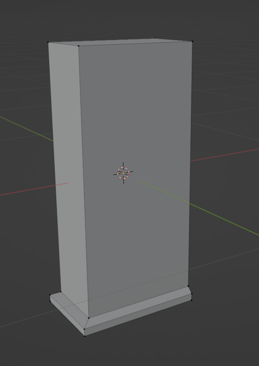
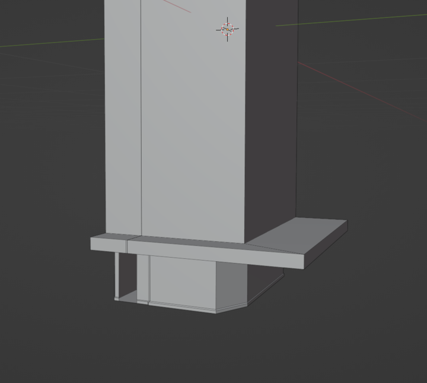
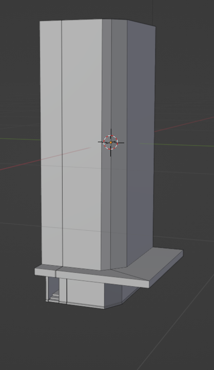
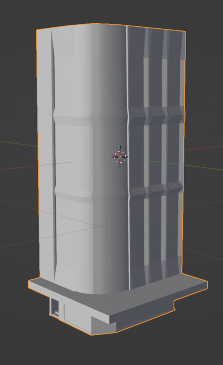

## Hour 2:

I modelled a tree, street lamp, path and started on a road>

### Progress:

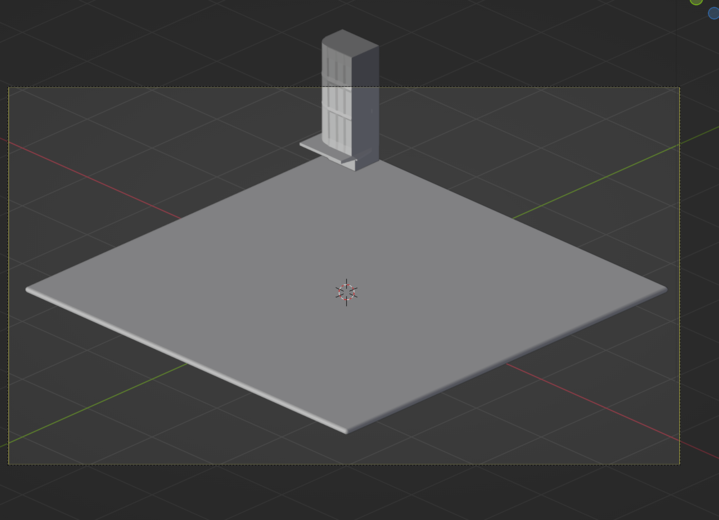
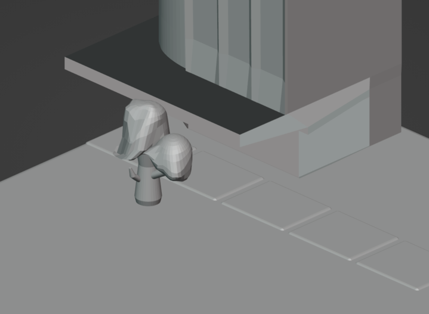
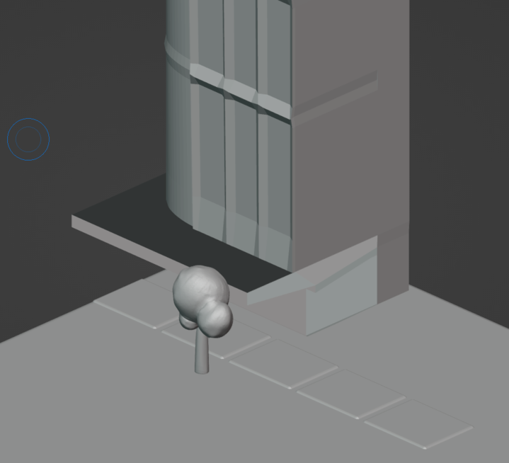

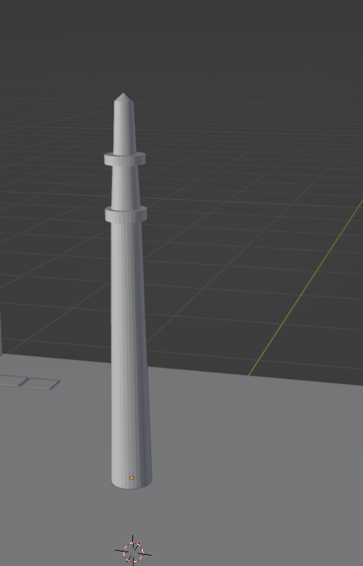
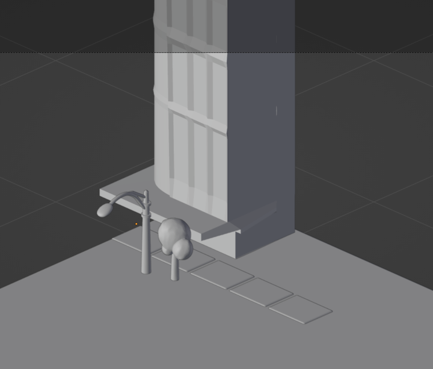
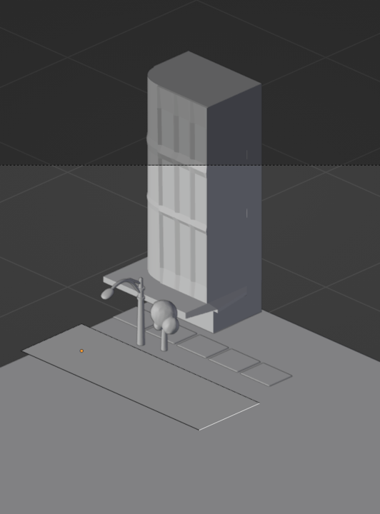

## Hour 3:

I modeled a house, gave it a fence, made a road and started a bin

### Progress:

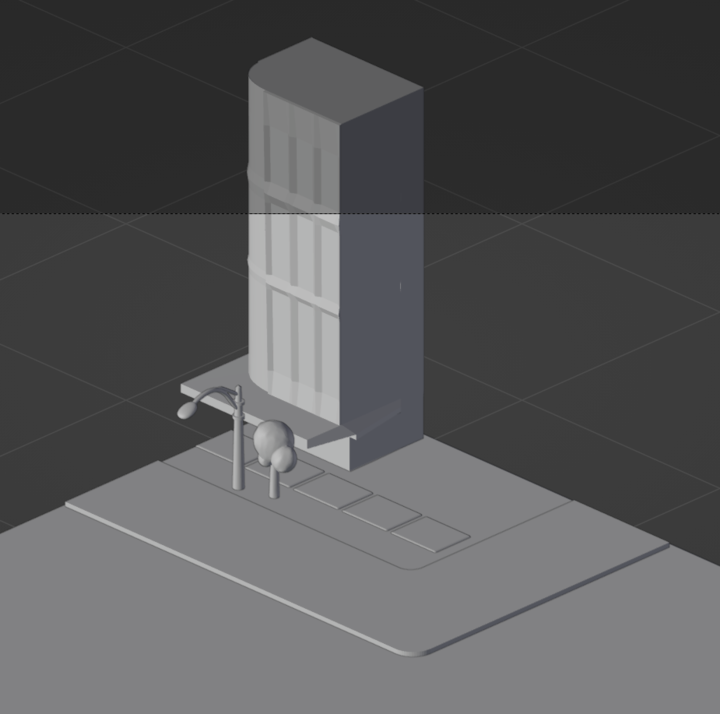
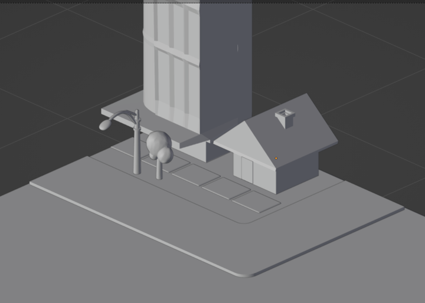
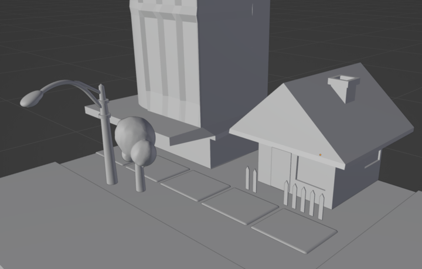

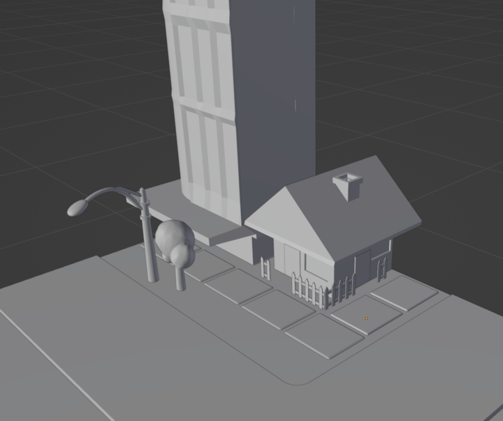

