# MelbourneModel

## Hour 1:

I modeled the first building which I found more dificult than expected.

### Progress:

## Hour 2:

I modelled a tree, street lamp, path and started on a road>

### Progress:

## Hour 3:

I modeled a house, gave it a fence, made a road and started a bin

### Progress:

## Hour 4:

Finished the bin, Made a park bench, a bus stop sign and a traffic light.

### Progress:

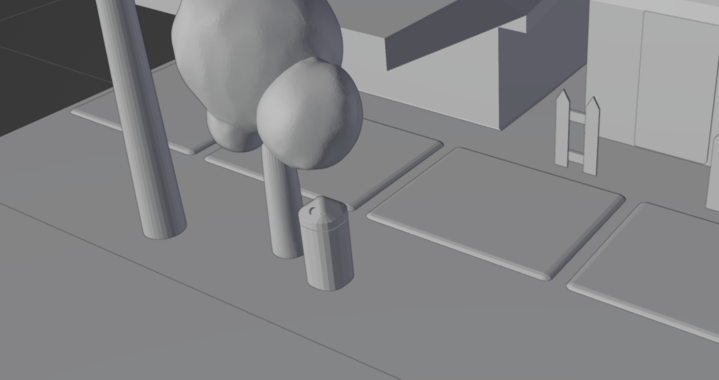
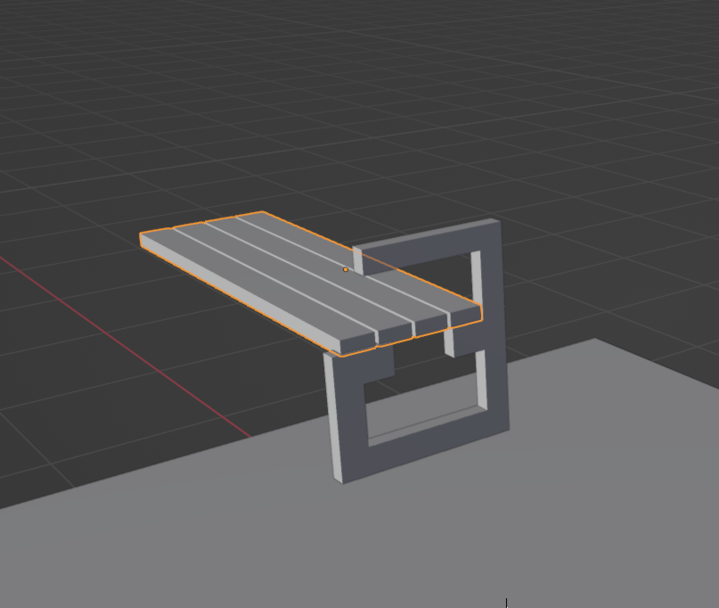
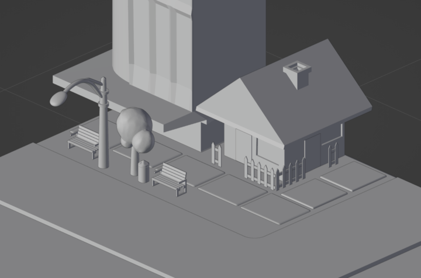
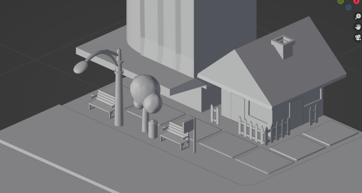
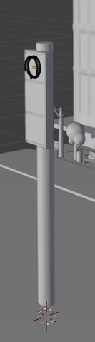
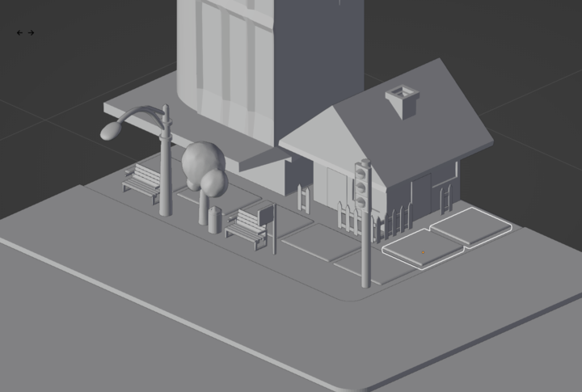

## Hour 5:

Made a new tree, a building and placed some paths.

### Progress:

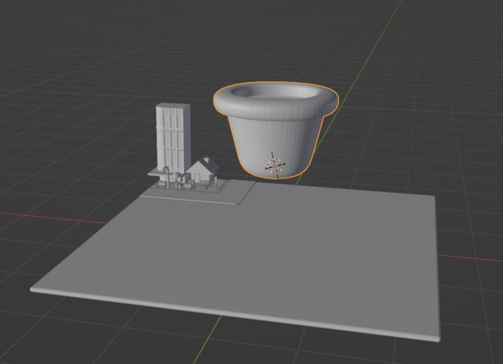
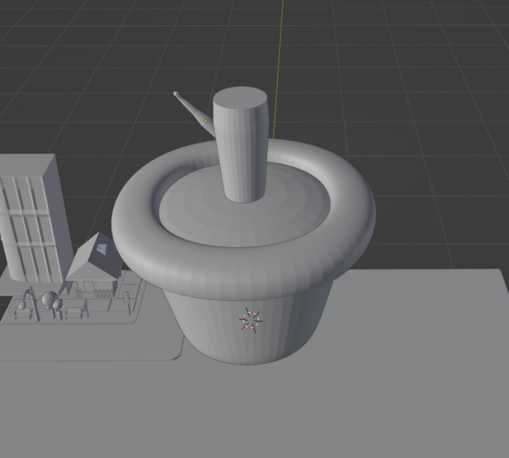
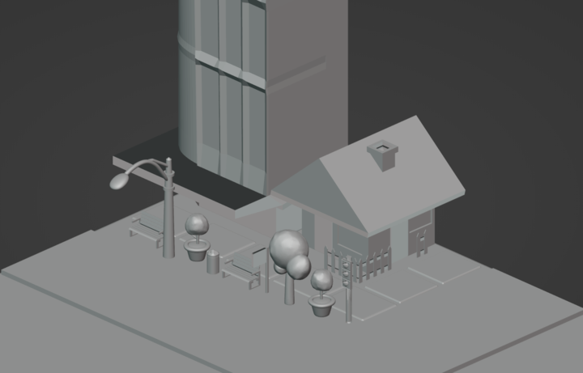
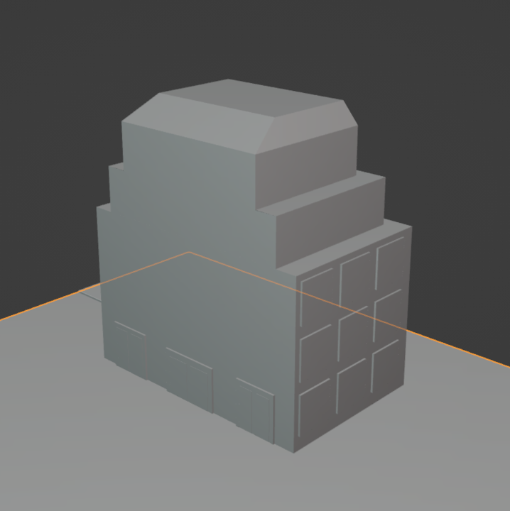
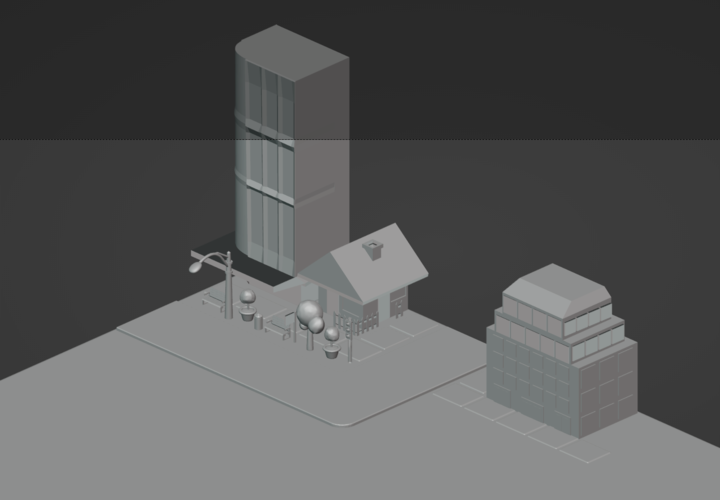

## Hour 6:

Made a library and a park outside it.

### Progress:

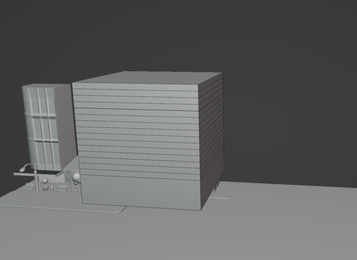
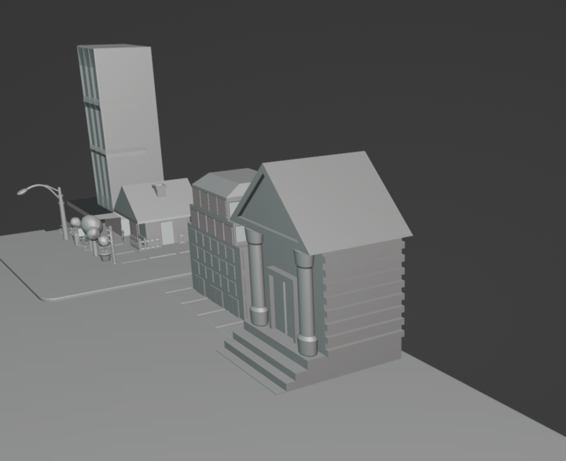
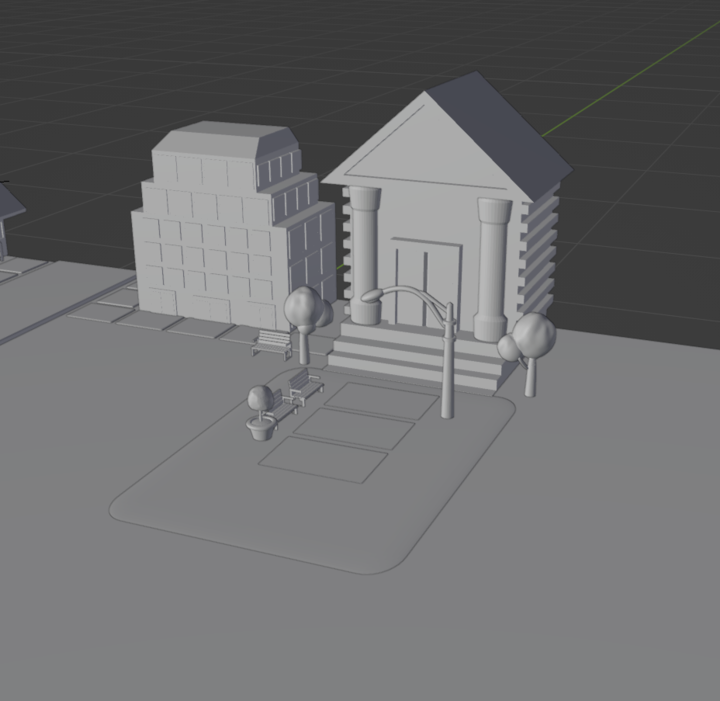
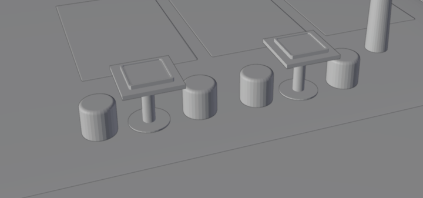
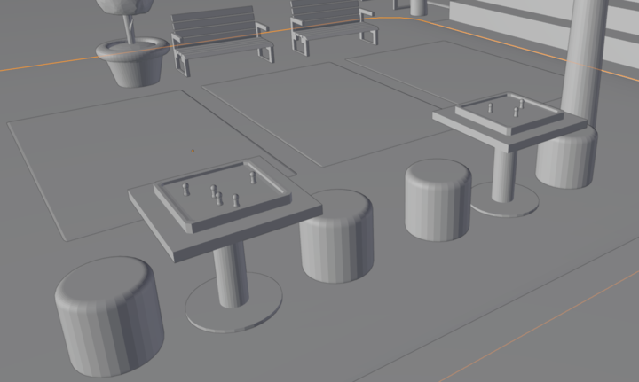
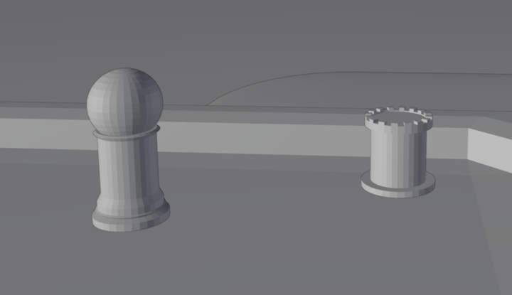
